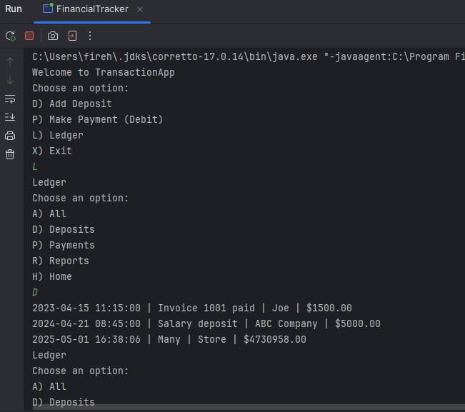
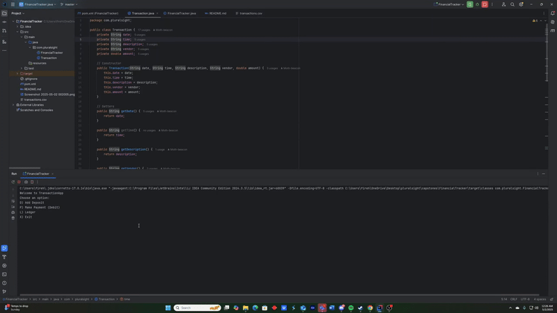

# Financial Tracker

## Description of the Project
This Java CLI application allows users to track their financial transactions—such as deposits and payments—in a personal ledger. Users can add transactions, view their full ledger, filter by dates or vendors, and generate useful reports. The project simulates a basic accounting system for personal or academic use.

## Demo Screenshot

## User Stories
- As a user, I want to be able to input my data so that the application can process it accordingly.
- As a user, I want to receive immediate feedback, so I can understand what to do next.

## Setup
1. Open IntelliJ IDEA.
2. Select "Open" and navigate to the directory where the project is located.
3. After it loads, wait for IntelliJ to index the files and configure the project.
4. Run the class with the `public static void main(String[] args)` method.
5. Right-click on the file and select **Run 'FinancialTracker.main()'** to launch the application.

## Technologies Used
- **Language:** Java 17
- **Build Tool:** Maven
- **Libraries Used:** None beyond Java SE 17 standard libraries

## Demo Gif

## Future Work
- Allow editing or deleting of transactions.
- Add password protection for privacy.
- Improve filtering (e.g. by category or tags).

## Resources
- Raymond’s Java cheat sheets
- [W3Schools - Java](https://www.w3schools.com/java/)
- [Stack Overflow](https://stackoverflow.com)
- Earlier C++ assignments from college coursework
- Earlier Java assignments in LTCA

## Team Members
- Raymond (instructor)
- *This project was completed individually by the student (aka ME)*

## Thanks
- Special Thank you to **Raymond Maroun** for continuous support and guidance.
- A thanks to all previous coursework and resources that inspired and supported this build.
 